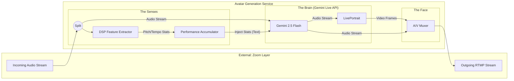

# Design Doc: Real-Time Avatar Generation (Music Teacher)

**Author:** Mena Yang
**Status:** Draft v2
**Last Updated:** February 13, 2026

## 1. Executive Summary

This module functions as a real-time processing service that sits behind the Zoom connection layer.

Its core responsibility is to **listen** to a student's music performance, **wait** for a cue from the host, and engage in **multi-turn coaching conversations** via a lip-synced avatar.


## 2. Scope & Goals

### 2.1 Core Responsibilities

* **Continuous Analysis:** Continuously monitor audio for musical features (tempo, pitch, rhythm) even when not speaking.
* **Intent Recognition:** Detect "Wake Phrases" (start of conversation) and "Follow-up Questions" (continuation of conversation).
* **Context Retention:** Maintain a short-term memory of the current conversation thread.
* **Avatar Rendering:** Generate realistic, low-latency video frames of a talking avatar using Text-to-Speech (TTS) and Image-to-Video models.
* **Stream Publishing:** Combine generated audio and video into a synchronized RTMP/RTSP stream for the Zoom bot to broadcast.


## 3. High-Level Architecture



## 4. Control Loop: Conversational State Machine

We use a 4-stage State Machine to handle natural back-and-forth conversation.

### State 1: Passive Listening (Background)

* **Status:** Avatar is Idle (Listening Loop).
* **Action:**
* DSP analyzes music and **appends to Full Session History (ACC)**.
* ASR listens *only* for "Wake Words" (e.g., *"Teacher, comment"*).


* **Transition:** Wake Word Detected  Go to State 3 (Responding).

### State 2: Active Listening (Follow-Up Window)

* *Entered immediately after the Avatar finishes speaking.*
* **Status:** Avatar is Idle (Listening Loop).
* **Timer:** 10-second countdown.
* **Action:** ASR listens for **Any Speech** (No wake word required).
* **Logic:**
* If User speaks: Treat as "Follow-up Question"  Go to State 3.
* If User plays music: Cancel timer  Go to State 1.
* If Timer expires: **End Conversation Turn** (Keep Music Stats, clear Chat Buffer)  Go to State 1.


### State 3: Responding (Thinking)

* **Action:**
1. **Generate Performance Summary** (Math calculation on full ACC history).
2. Fetch Conversation History (if follow-up).
3. LLM generates response.
4. Update History.


* **Transition:** Generation Complete  Go to State 4.

### State 4: Speaking (Rendering)

* **Action:** LivePortrait renders video; TTS plays audio.
* **Interruption Logic (Barge-In):**
* If ASR detects User Speech OR DSP detects Music > Threshold:
* **STOP** TTS/Video immediately  Go to State 2 (if Speech) or State 1 (if Music).


* **Transition:** Speaking Finished (Normal)  Go to State 2 (Active Listening).
## 5. Model Candidates & Resource Requirements

We will evaluate the following models to determine the optimal balance between quality and latency.


### 5.1 The "Brain" (Audio-to-Audio)

Instead of a complex chain of models, we use a single Multimodal endpoint.

| Component | Model | Implementation | Why? |
| --- | --- | --- | --- |
| **Core Logic & Voice** | **Gemini 2.5 Flash** | **Google Multimodal Live API** (WebSocket) | Handles Hearing, Thinking, and Speaking in one low-latency connection. Supports native "Barge-in" (interruption). |
| **Music Analysis** | **Torch-Crepe + Madmom** | Local Python Process | **Crucial:** Gemini provides the conversation, but this DSP provides the *facts* (Pitch/Rhythm accuracy) which are injected into Gemini as context. |


### 5.2 Video Analysis

*Goal: Check posture and hand position. (Optional but high value).*

| Component | Recommended Model | Why? |
| --- | --- | --- |
| **Body/Hand Pose** | **MediaPipe Holistic** (Google) | The industry standard for real-time pose. It runs comfortably on CPU, leaving the GPU free for the Avatar. It tracks 33 body landmarks (posture) and 21 hand landmarks (fingering). |

* **Metric to Extract:**
* **Shoulder Level:** Are shoulders raised? (Sign of tension).
* **Wrist Height:** Is the wrist collapsing? (Common piano mistake).

### 5.3 Text Generation

*Goal: Take the JSON stats from analysis and turn them into a kind, helpful sentence.*

We need a model that follows instructions perfectly (to produce JSON or very short text) and has low "Time to First Token" (TTFT).

| Candidate | Recommendation Level | Pros/Cons |
| --- | --- | --- |
| **Llama 3.1 8B (Quantized)** | **Primary Choice (Local)** | **Pros:** Runs locally on the same GPU as the Avatar (takes ~5GB VRAM). Zero network latency. "Instruct" version is excellent at roleplaying.<br>

<br>**Cons:** Requires managing VRAM carefully so it doesn't crash LivePortrait. |
| **GPT-4o-mini** | **Secondary Choice (Cloud)** | **Pros:** Extremely fast, cheap, and smarter at "conversation" than small local models. Offloads compute from your GPU.<br>

<br>**Cons:** Adds ~300ms network round-trip latency. |

### 5.4 Avatar Rendering (Video Generation)

| Candidate | Pros | Cons | VRAM Est. | Target FPS (3090) |
| --- | --- | --- | --- | --- |
| **LivePortrait** (Primary) | SOTA expression transfer; handles head movement beautifully. | Slightly higher latency than SadTalker. | ~4.5 GB | ~35 FPS |
| **MuseTalk** (Backup) | Designed specifically for real-time; extremely fast. | Lower visual fidelity; mostly just lip movement (less head motion). | ~6.0 GB | ~45 FPS |
| **SadTalker** (Baseline) | Mature, easy to deploy. | Stiff head movement; "uncanny valley" effect. | ~4.0 GB | ~30 FPS |

### 5.5 Speech Recognition (ASR)

| Candidate | Type | VRAM Est. | Latency |
| --- | --- | --- | --- |
| **Faster-Whisper (small.en)** | Local (CTranslate2) | ~1.0 GB | ~200ms |
| **Distil-Whisper (distil-medium.en)** | Local | ~1.5 GB | ~150ms |
| **Deepgram Nova-2** | Cloud API | 0 GB | ~300ms (Network dependent) |

### 5.6 Text-to-Speech (TTS)

| Candidate | Type | Latency (TTFB) | Voice Quality |
| --- | --- | --- | --- |
| **OpenAI TTS (HD)** | Cloud API | ~300ms | Excellent (Very natural) |
| **ElevenLabs Turbo v2.5** | Cloud API | ~250ms | Superior (Highly emotional) |
| **StyleTTS2** | Local | ~100ms | Good (Requires fine-tuning) |

### 5.4 Total System Budget (Estimated)

* **Target GPU:** NVIDIA RTX 3090 (24GB) or A10G (24GB).
* **Total VRAM Usage:** ~12-14GB (Safe headroom for concurrent operations).

## 6. Evaluation Metrics & Benchmarks

To accept the system for production, it must pass these specific benchmarks.

### 6.1 Performance Metrics

* **Latency (End-to-End):** Time from Host finishing the wake word to Avatar first frame/sound.
* *Target:* < 2.0 seconds.


* **Turn-Taking Latency:** Time from User finishing a follow-up question to Avatar answering.
* *Target:* < 1.5 seconds (Faster than initial wake-up).


* **Real-Time Factor (RTF):** `Render Time / Audio Duration`.
* *Target:* < 0.8 (Must render faster than real-time to prevent buffering).


* **FPS Stability:** Percentage of time video stream stays above 24fps.
* *Target:* > 99%.


### 6.2 Quality Metrics

* **LSE-D (Lip Sync Error - Distance):** Distance between audio features and visual lip coordinates. (Lower is better).
* **Trigger False Positive Rate:** How often the avatar interrupts without being asked.
* *Target:* < 1 per hour.


* **Context Success Rate:** Percentage of times the avatar correctly understands "it" or "that" referring to the previous turn.

## 7. Experimental Plan

We will conduct the following experiments in order:

### Experiment 1: The "Speed" Test

* **Goal:** Determine if **LivePortrait** can sustain 24fps on our target GPU while ASR is running in the background.
* **Method:**
1. Load LivePortrait + Faster-Whisper on one GPU.
2. Simulate continuous ASR transcription.
3. Trigger Avatar generation every 10 seconds.
4. Log average FPS and GPU VRAM spikes.


### Experiment 2: The "Sync" Test (Drift Analysis)

* **Goal:** Tune the **Jitter Buffer** to align TTS audio with Video.
* **Method:**
1. Generate a video where the avatar counts "1, 2, 3...".
2. Record the RTMP output.
3. Manually measure the offset between the audio "One" and the lips opening.
4. Adjust the audio delay (e.g., +200ms) until offset is < 50ms.


### Experiment 3: The "Trigger" Test 

* **Goal:** Calibrate the ASR Wake Word threshold.
* **Method:**
1. Play a 1-hour recording of a music lesson (without wake words) into the input.
2. Count how many times the avatar accidentally triggers.
3. Adjust the fuzzy match threshold (e.g., from 80% to 90%) until False Positives = 0.


### Experiment 4: The "Barge-In" Test

* **Goal:** Ensure the teacher stops talking if interrupted.
* **Method:**
1. Trigger a long avatar response.
2. Mid-sentence, inject loud student audio ("Wait, stop!").
3. Measure time-to-silence (Target: < 500ms).


## 8. Interface Definition

This service exposes endpoints for the System Coordinator.

**Start Session**
`POST /session/start`

```json
{
  "rtmp_ingest_url": "rtmp://localhost/live/student_audio", 
  "rtmp_publish_url": "rtmp://zoom-bot/live/avatar_stream",
  "persona_id": "teacher_mary_v1"
}

```

**Update Config**
`POST /session/config`

```json
{
  "wake_phrases": ["comment", "suggestion", "feedback"],
  "strictness": "high"
}

```

**Force Reset (Clear Context)**
`POST /session/reset_context`

* *Usage:* Call this when a new student sits down or a new piece begins, to wipe the `chat_history`.

## 9. Technology Stack (Implementation)

* **Language:** Python 3.10+
* **Concurrency:** `asyncio` for non-blocking I/O.
* **Inference:** PyTorch (LivePortrait), CTranslate2 (Whisper).
* **Audio Processing:** `librosa` (Music features), `pydub` (Audio manipulation).
* **Streaming:** `ffmpeg-python` (RTMP Muxing).

## 10. Risks & Mitigations

* **Risk:** Avatar stays in "Active Listening" too long and responds to background noise.
  * *Mitigation:* Strict VAD (Voice Activity Detection). If the input is just noise/music, do not trigger the LLM.


* **Risk:** Hallucinating Context.
  * *Mitigation:* Limit `chat_history` to the last 3 turns only. Music coaching rarely needs context older than that.


* **Risk:** GPU OOM (Out of Memory).
  * *Mitigation:* Run ASR and Avatar Generation on separate CUDA streams. Unload LivePortrait reference tensors when in Idle mode if necessary.
